<h1 align="center">Ⓜ️ May Ⓜ️</h1>

## _(Monday) May 23_ 📢

`Learning about:` 💡
* **Enquirer**

>### Input `Example` ❓
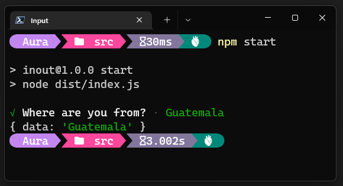

>### Form `Example` 📌
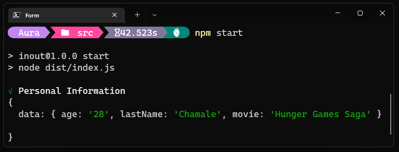

>### Select `Example` 📎
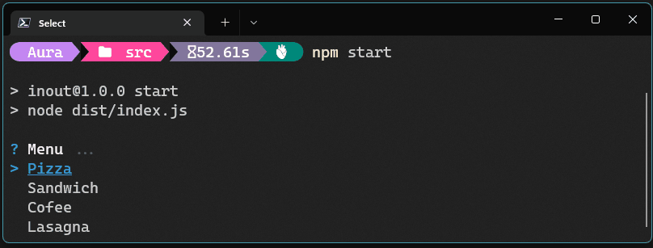

>### Select By Id `Example` 🔢
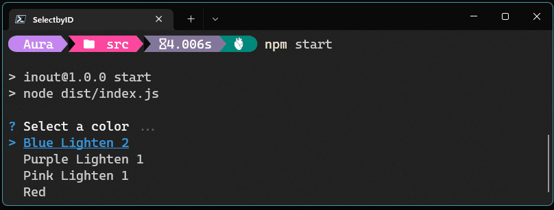

>### Confirm `Example` ✅
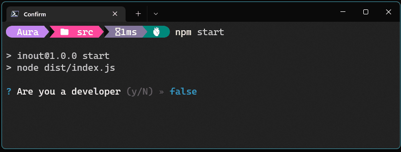

>### OOP in TypeScript Guide `Exercise` 👓
>#### [Learning about 🧠 What is OPP? 😶‍🌫️ The Four Principles and other functions 🤯 HERE!!](May/assets/guide.md)

## _(Tuesday) May 24_ 📢
>### Food Menu 👩‍🍳 `Exercise`
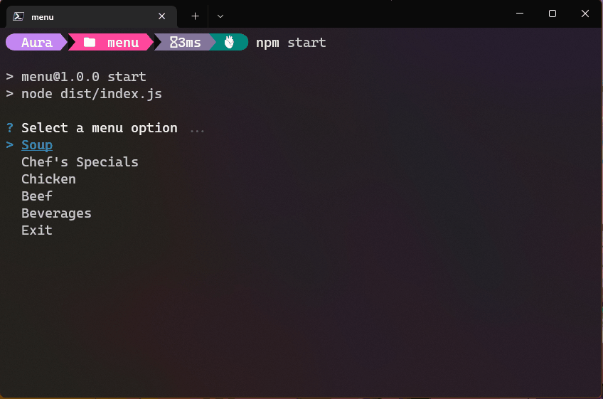

>### Movies 📽️ `Exercise`

>### Menu and Exit 🎬
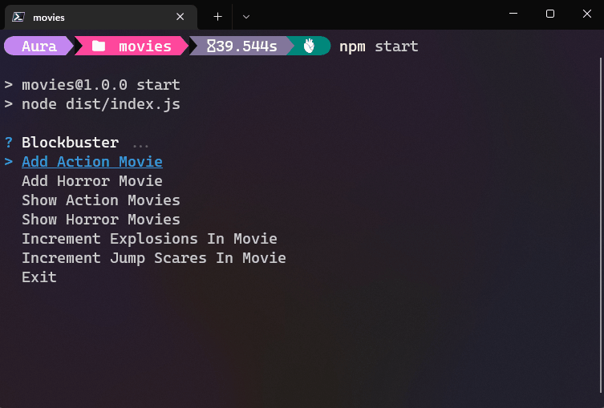

>### Add Action Movie 🚓
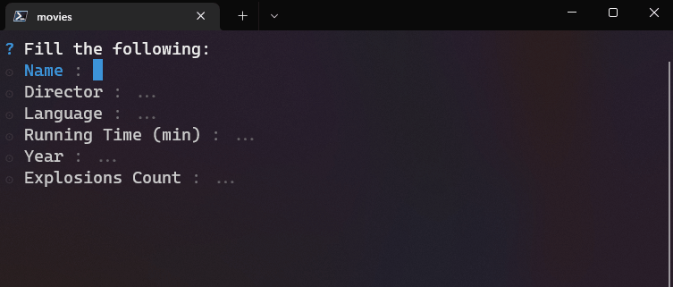

>### Add Horror Movie 🪦
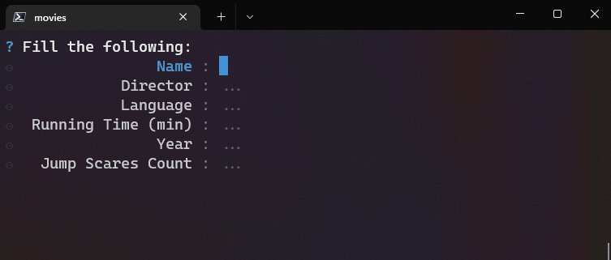

>### Action Movies List 🚀
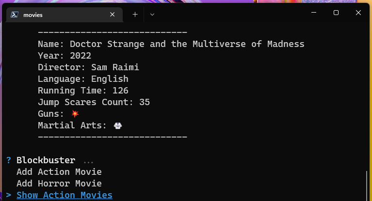

>### Horror Movies List ☠️
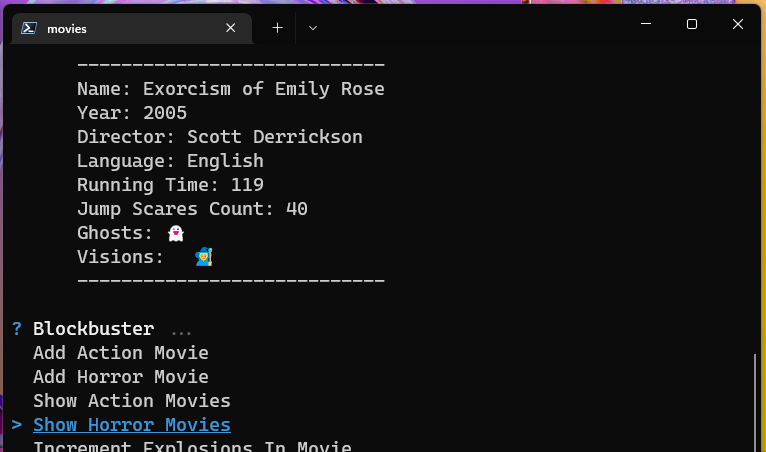

>### Increment Explosions ☢️
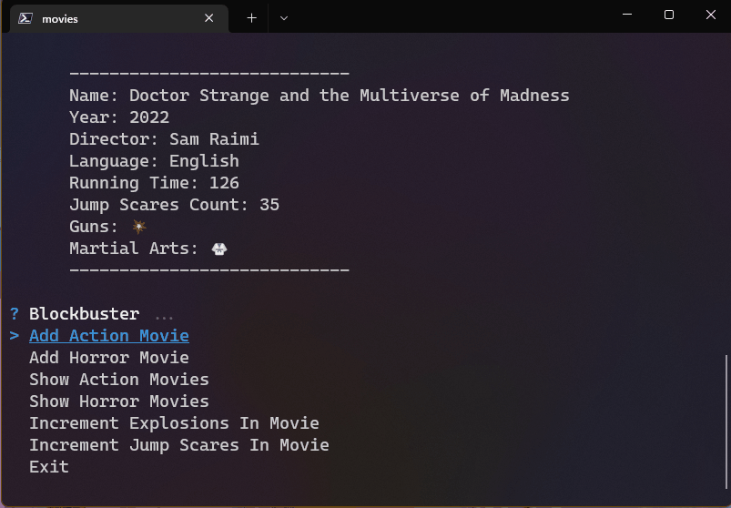

>### Increment Jump Scares 😨
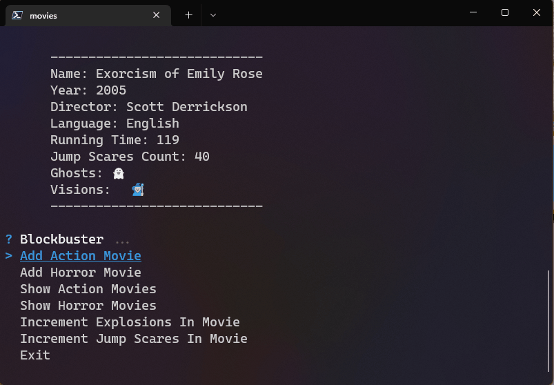

## _(Wednesday) May 25_ 📢
>### Interfaces Guided `Exercise`
```typescript 

```

>### Build Tower `Exercise`
```typescript 
export const towerBuilder = (nFloors: number): string[] => {
  let array = [];
  for (let i = nFloors; i >= 1; i--) {
    let space = (nFloors - i);
    let stars = i * 2 - 1;
    array.push(" ".repeat(space) + "*".repeat(stars) + " ".repeat(space));
  }
  return array.reverse();
}
```

>### Meeting `Exercise`
```typescript 
export function meeting(s: string): string {
   return s
    .split(';')
    .map((el) => '(' + el.split(':').reverse().join(', ').toUpperCase() + ')')
    .sort()
    .join('');
}
```

## _(Thursday) May 26_ 📢
`Learning about:` 💡
* **Object Oriented Programming - The Four Pillars of OOP** 💠
* **Abstract Classes vs Interfaces** 🥊
* **Abstract Classes** 💭

## [📎 Back to main page !📎](/home/readAura.md)
